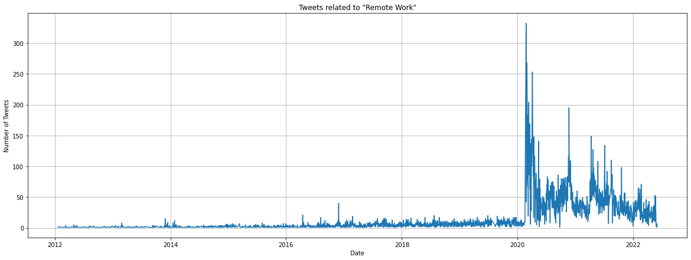
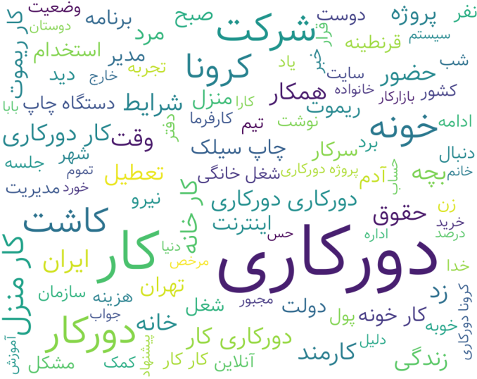
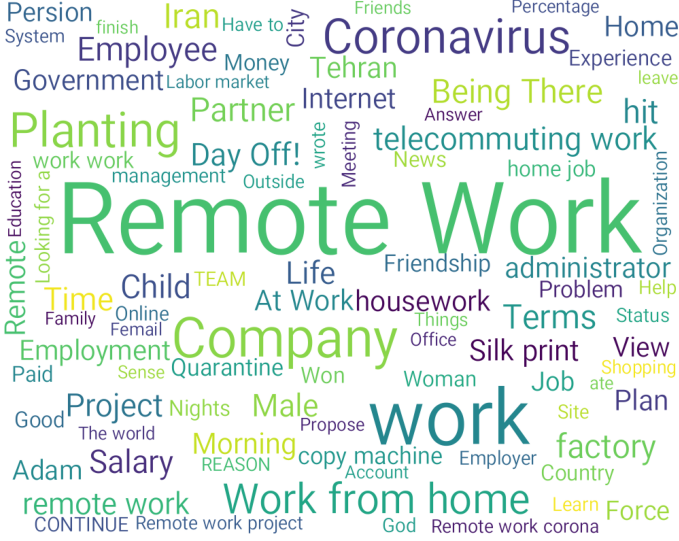
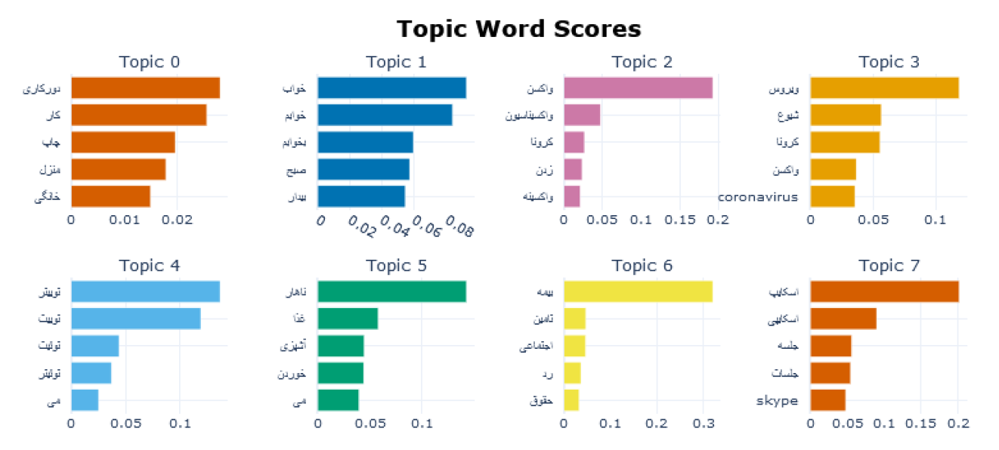
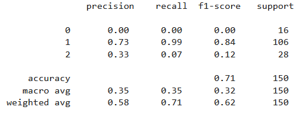
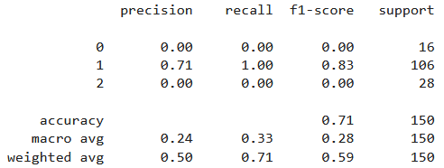
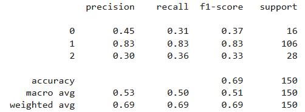
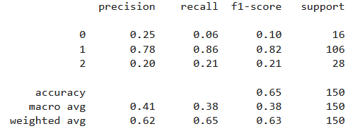

# Remote Work Twitter Analysis
This is a data analysis project using ML/NLP techniques concerning tweets relevant to remote work.

## Data
To conduct the analysis of Persian tweets related to remote work during the COVID-19 pandemic, we employed the **Twitter API** to fetch Persian Twitter data. A dataset comprising **45,359** remote work-related tweets was extracted using specific Farsi and English query phrases.

We focused on selecting tweets relevant to remote work from the collected Persian tweets. We designed a comprehensive query using the Elasticsearch Query DSL to target specific words and phrases associated with remote work in Persian. The query included a range of terms such as *"کار از منزل" (work from home)*, *"کار در خانه" (work at home)*, *"کار از راه دور" (remote work)*, and various other related terms. By utilizing this query, we ensured that our data collection process focused on tweets that explicitly mentioned or discussed remote work. This allowed us to gather a relevant and representative dataset for our analysis. We excluded certain fields such as thumbnails, photos, and videos to focus solely on the textual content of the tweets, enabling us to examine the discourse surrounding remote work during the pandemic more comprehensively.

   
    
   
  <em>Tweet Counts</em>

## Preprocessing

We removed duplicate **chars** and **emojis** (available in *emojies.txt*), **stop-words** (available in the *stopwords* folder), **Unicode errors**, **URLs**, **phone numbers**, **emails**, **currency symbols**, and useless punctuations and chars. Also, **normalization** and **lemmatization** were applied using tools like `Hazm`, which is optimized for the Persian language, and `NLTK`.

      
      
     
    <em align="center">&emsp;&emsp;&emsp;Wordcloud (Persian)&emsp;&emsp;&emsp;&emsp;&emsp;&emsp;&emsp;&emsp;&emsp;&emsp;Wordcloud (Translated)&emsp;&emsp;</em>
   

## Topic Modeling
Topic modeling is a type of statistical modeling that uses **unsupervised** Machine Learning to identify **clusters** or groups of similar words within a body of text. This text mining method uses semantic structures in text to understand unstructured data without predefined tags or training data.

Three algorithms, **Latent Dirichlet Allocation (LDA)**, **Gibbs Sampling Dirichlet Mixture Model (GSDMM)**, and **BERTopic**, were employed for this analysis. BERTopic is one of the Masked Language Models and contextualized models, while LDA and GSDMM are not.

### Latent Dirichlet Allocation (LDA)
Latent Dirichlet Allocation (LDA) is used as a topic modeling technique that can classify text in a document to a particular topic. It uses **Dirichlet distribution** to find topics for each document model and words for each topic model. LDA is a technique to map sentences to topics. LDA extracts certain sets of topics according to the topic we fed to it.

### Gibbs Sampling algorithm for a Dirichlet Mixture Model (GSDMM)
GSDMM (Gibbs Sampling Dirichlet Multinomial Mixture) is a short text clustering model. The model solves the sparsity problem of short text clustering while also displaying word topics like LDA. GSDMM is essentially a modified LDA that assumes that a document (tweet) encompasses 1 topic. This differs from LDA which assumes that a document can have multiple topics. 

Both **lemmatized** and **not lemmatized** tweets were considered. Furthermore, the impact of different text representation methods, including term frequency-inverse document frequency (**tf-idf**) and bag-of-words (**BOW**), on the performance of these models was explored.

### BERTopic
BERTopic is a topic modeling technique that leverages **BERT** embeddings and **c-TF-IDF** to create dense clusters allowing for easily interpretable topics whilst keeping important words in the topic descriptions. The topics extracted are mainly about **sleeping**, **vaccination**, **COVID-19**, **insurance**, **online meetings and Skype**, and **internet speed and problems**.

   
  
   
  <em>Topics by BERTopic</em>

## Sentiment Analysis
A sample of **1,500** tweets was labeled manually based on three categories of **opposition**, **acceptance**, and **neutral**. **Naive Bayes** and **Transformer** models were employed.

### Naive Bayes

   
    
   
  <em>Results by Naive Bayes</em>

### Transformers
Incorporating transformer-based architectures, such as **ParsBERT**, **BERTweet-FA**, and **XLM-RoBERTa**, for the text classification task.

   
    
    
    
   
  <em>Results by XLM-RoBERTa &emsp;&emsp;&emsp;&emsp;&emsp; Results by ParsBERT &emsp;&emsp;&emsp;&emsp;&emsp;&emsp;&emsp; Results by BERTweet-FA</em>

